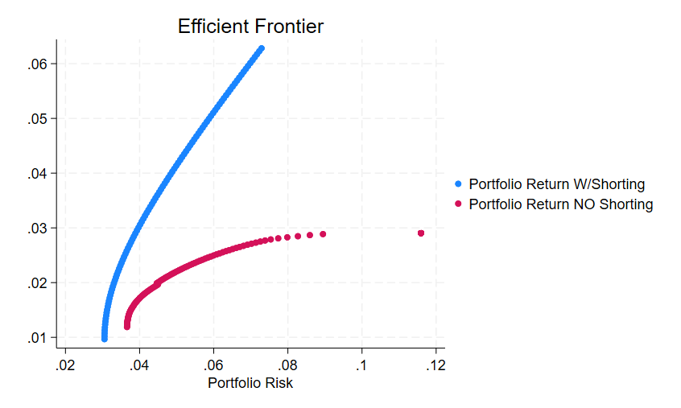
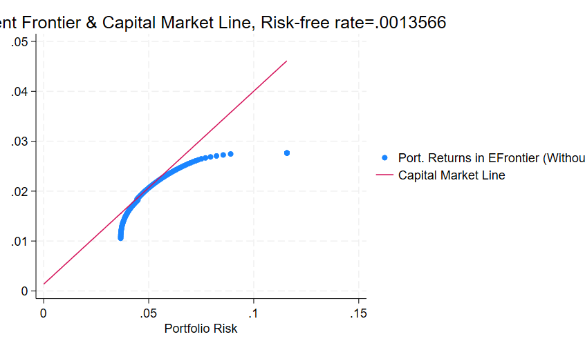
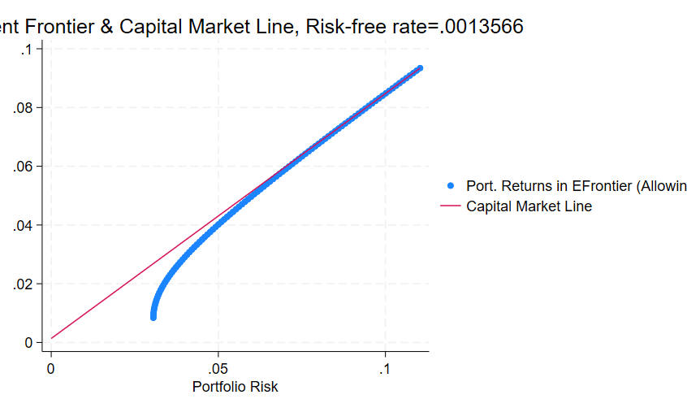

# Investment Analysis Project

This repository contains an end-to-end analysis of asset returns and portfolio strategies using CRSP stock data and Fama-French factors. The goal is to implement portfolio optimization, asset pricing tests, and performance evaluation of investment strategies.

## Methodology

1. **Data Cleaning:** Filter common stocks, valid prices, and sufficient trading history  
2. **Portfolio Optimization:** Use mean-variance framework to build efficient frontier  
3. **Risk Preference Estimation:** Calibrate investor utility functions  
4. **Asset Pricing Models:** Estimate CAPM and run Fama-MacBeth regressions  
5. **Strategy Evaluation:** Build and compare active vs passive portfolios

## Key Results

The following graph depics efficient frontiers allowing/not allowing shorting.

The following 2 graphs showcase capital allocation lines with short/no short allowed.

- Risk aversion levels significantly influence optimal portfolio composition  
- Fama-MacBeth regressions show statistically significant pricing errors for some factors  
- Passive investing generally outperformed high-turnover active strategies over the sample period

- ## References

- Markowitz, H. (1952). Portfolio Selection  
- Fama, E.F., & French, K.R. (1993). Common Risk Factors  
- Cochrane, J. (2005). Asset Pricing
